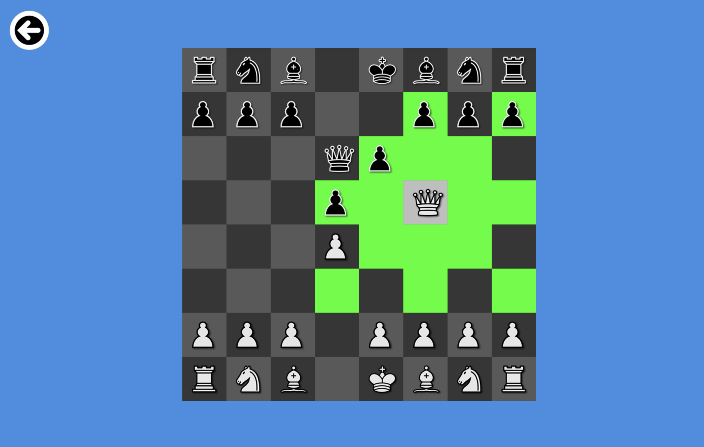
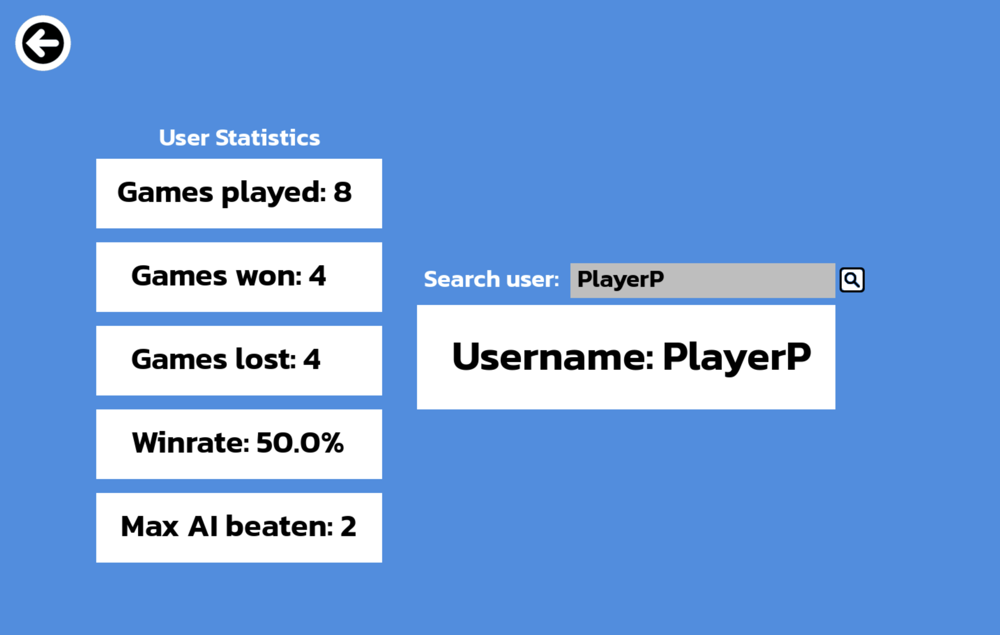

# Chess

A desktop chess application developed in Python using the Pygame module. It has both local two-player and computer opponent game modes.



*Legal moves for selected piece, demonstrating friendly blocks and enemy captures*

## Features

- **Local two-player** and **computer opponent** game modes
- Legal move generation with complete check, checkmate and stalemate detection
- Highlighting of legal moves for selected piece
- Optimal move highlighting alongside normal play
- Local user account + statistics storage with SHA-256 hashed passwords
- Statistics panel including games played, won, lost and winrate with admin lookup of other users



*User game statistics with an admin-only search bar to lookup other users*

## Running the program

```bash
pip install -r requirements.txt
python Chess.py
```

Developed on Python 3.14 with pygame-ce.

## Move generation

There are two stages for generating moves:

1. Pseudo-legal moves are created without checking own king's safety, using only piece movement and block/capture rules.

2. True legal moves are created by simulating all the pseudo-legal moves separately on the board. If the friendly king isn't put in check after the move, it is legal. Checkmate and stalemate detection follows from this: if there are no legal moves and your king is in check, it's a checkmate; if there are no legal moves and your king is not in check, it's a stalemate. After simulating a test piece, the move is undone to preserve game integrity.

Check detection works by placing every opposite-team piece type in place of the king to be tested for check, one at a time. Pseudo-legal moves are generated for this test piece, and if it can capture the same type of the opposing team from that position, the test piece type has put the original king in check from wherever the original piece was.

## Optimal move generation and computer opponent

The computer opponent and optimal move generation uses the same underlying algorithm: minimax with alpha-beta pruning. The depth used is 3 and this represents the difficulty of the computer opponent as well as quality of optimal moves (higher = better). Positions are solely scored on the outcome of material exchanges with standard piece values, including a large enough bonus for checkmate to prioritise it over all other positions. Alpha-beta discards branches that cannot change the final decision, giving a substantial increase in performance over standard minimax.


*Optimal move that could've been made shown in purple, actual move made by player in green*

## Known limitations

- Castling, en passant and pawn promotion not implemented
- Evaluation uses material value only
- Administrator privileges are hardcoded for a single username
- Difficulty is not adjustable in GUI
- Optimal move finding is slow because legal moves are recalculated at every node of the search

## Credits

The chess piece sprites are from [JohnPablok's improved Cburnett chess set](https://opengameart.org/content/chess-pieces-and-board-squares) under the license [CC-BY-SA 3.0](http://creativecommons.org/licenses/by-sa/3.0/)
